# Ball and Beam Control System

<p align="center">
  
</p>

## Overview

The Ball and Beam System is a classical unstable control problem widely used in control engineering education and research. The objective is to control the position of a rolling ball along a beam by adjusting the beam inclination angle through a servo motor using a closed-loop PID controller.

This project presents the complete development cycle of a real Ball and Beam prototype following the **VDI 2206 Mechatronic Design Methodology**, including:

* Mechanical Design
* CAD Modeling
* Finite Element Analysis (FEA)
* Mathematical Modeling
* PID Controller Design
* MATLAB Simulation
* Simulink Simulation
* Arduino-Based Real-Time Control
* Hardware–Software Integration
* System Identification
* Experimental Validation

---

# Project Highlights

| Feature                      | Status |
| ---------------------------- | ------ |
| CAD Design                   | ✅      |
| Mechanical Analysis          | ✅      |
| Finite Element Analysis      | ✅      |
| Mathematical Modeling        | ✅      |
| Transfer Function Derivation | ✅      |
| PID Controller Design        | ✅      |
| MATLAB Simulation            | ✅      |
| Simulink Simulation          | ✅      |
| Arduino Implementation       | ✅      |
| System Identification        | ✅      |
| Experimental Validation      | ✅      |
| VDI 2206 Methodology         | ✅      |

---

# Hardware Prototype

<p align="center">
  
</p>

The physical prototype was developed and experimentally validated using:

* Arduino Uno
* MG995 Servo Motor
* HC-SR04 Ultrasonic Sensor
* Custom Mechanical Structure
* Voltage Regulation Circuit
* 12V Power Supply

---

# CAD Design

<p align="center">
  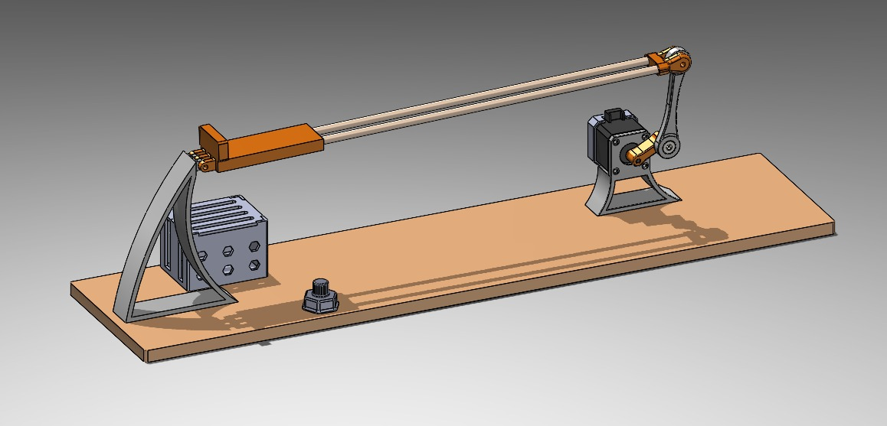
</p>

The complete mechanical assembly was designed and validated before fabrication.

Main subsystems include:

* Beam Assembly
* Linkage Mechanism
* Servo Mount
* Sensor Holder
* Structural Base

---

# System Architecture

```text
Reference Position
        │
        ▼
PID Controller
        │
        ▼
Arduino Uno
        │
        ▼
MG995 Servo Motor
        │
        ▼
Beam Angle
        │
        ▼
Ball Position
        │
        ▼
HC-SR04 Sensor
        │
        └──────────── Feedback
```

---

# Electronic Circuit

<p align="center">
  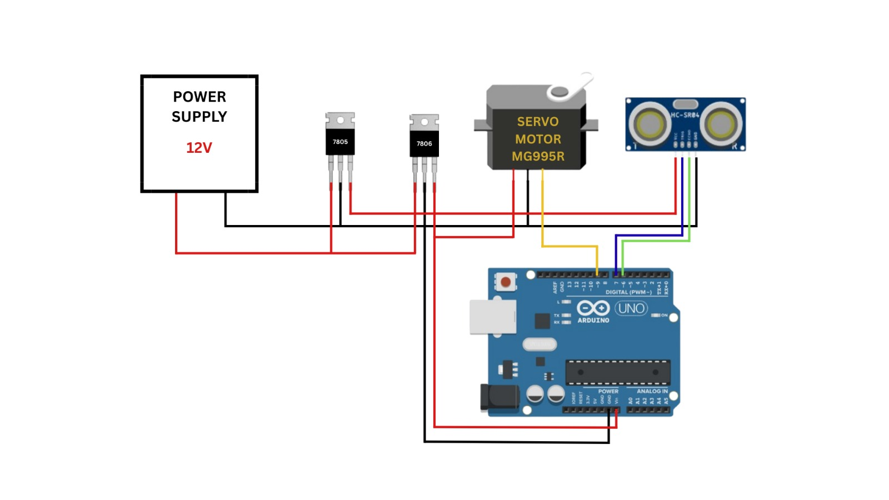
</p>

The control system consists of an Arduino Uno, MG995 servo motor, HC-SR04 ultrasonic sensor, voltage regulation stage, and external power supply.

---

# VDI 2206 Engineering Workflow

The project was developed following the VDI 2206 methodology for mechatronic systems design.

This approach integrates:

1. Requirements Definition
2. Mechanical Design
3. Electronics Design
4. Software Development
5. System Integration
6. Validation and Testing

---

# Mathematical Modeling

The Ball and Beam system behaves as a double integrator and is inherently unstable in open-loop operation.

Plant Transfer Function:

P(s) = 5.532 / s²

This characteristic requires feedback control to stabilize the ball position.

---

# Control System Design

## Open-Loop Behavior

The open-loop response demonstrates unstable system behavior where the ball position continuously diverges from the desired position.

<p align="center">
  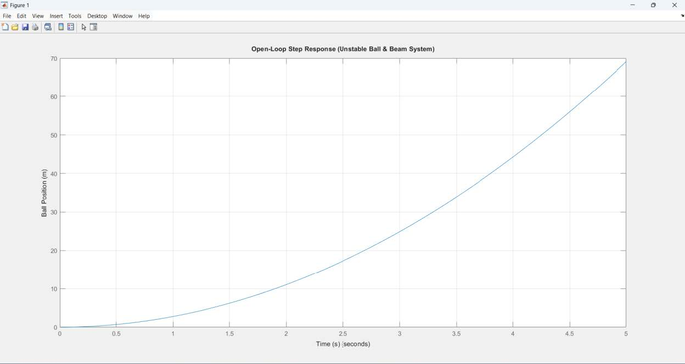
</p>

---

## Root Locus Analysis

Root locus analysis was used to investigate system stability and select suitable controller parameters.

<p align="center">
  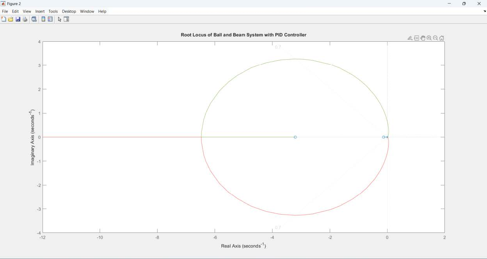
</p>

---

## PID Controller Design

Selected controller gains:

```matlab
Kp = 40
Ki = 5
Kd = 10
```

These values provided a good balance between:

* Fast Response
* Small Overshoot
* Zero Steady-State Error
* Acceptable Settling Time

---

## Closed-Loop Response

The PID controller successfully stabilized the system and achieved accurate ball position tracking.

<p align="center">
  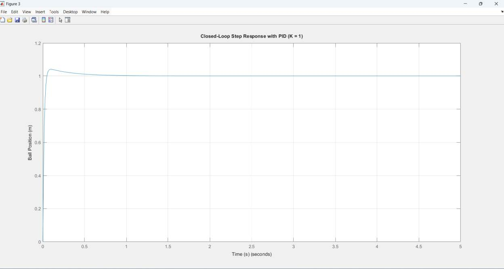
</p>

---

# PID Tuning Analysis

## Effect of Proportional Gain (Kp)

<p align="center">
  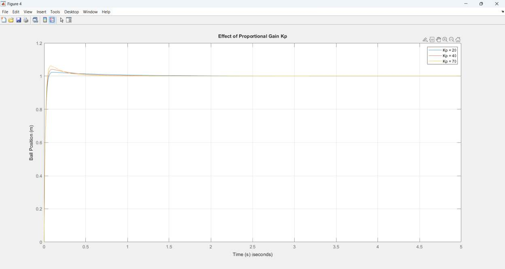
</p>

Increasing Kp improves response speed but may increase overshoot.

---

## Effect of Integral Gain (Ki)

<p align="center">
  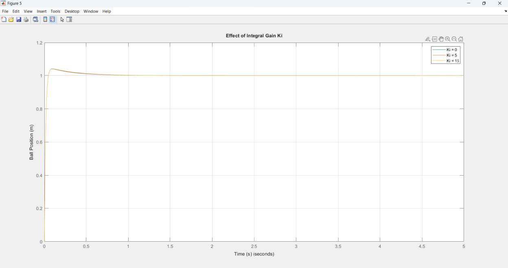
</p>

Increasing Ki reduces steady-state error and improves tracking accuracy.

---

## Effect of Derivative Gain (Kd)

<p align="center">
  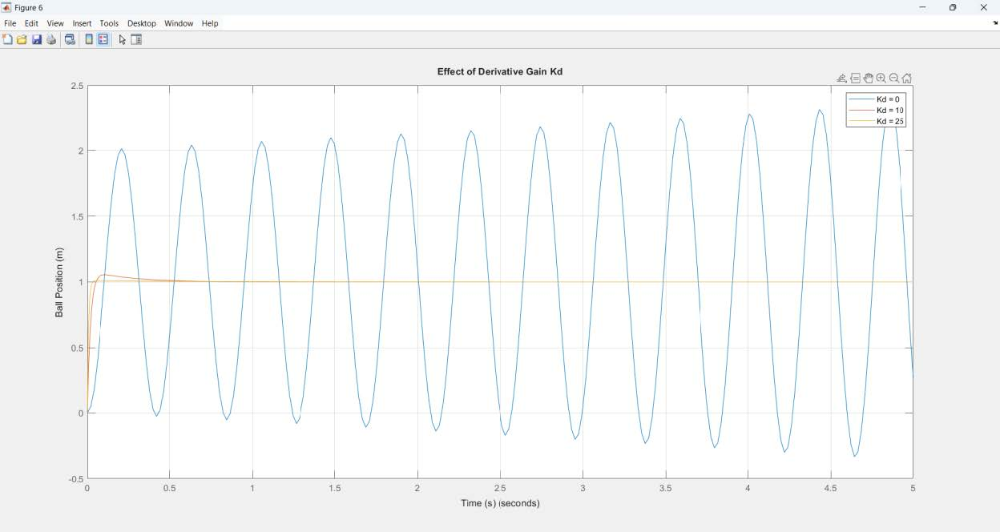
</p>

Derivative action increases damping and reduces oscillations.

---

# Simulink Modeling

## Open-Loop Simulink Model

<p align="center">
  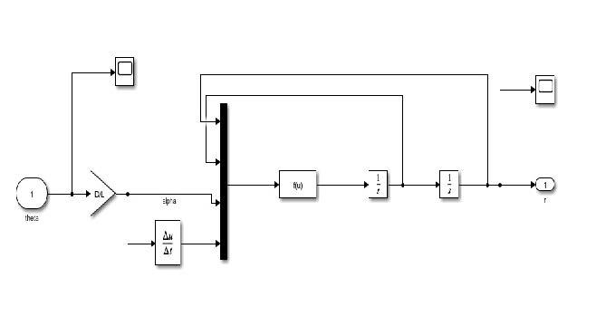
</p>

---

## Closed-Loop Simulink Model

<p align="center">
  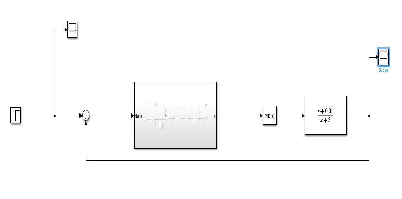
</p>

---

# Hardware–Software Integration

The PID controller was implemented on Arduino and connected to MATLAB using serial communication.

Features:

* Real-time data acquisition
* Live response visualization
* Closed-loop monitoring
* Performance analysis

<p align="center">
  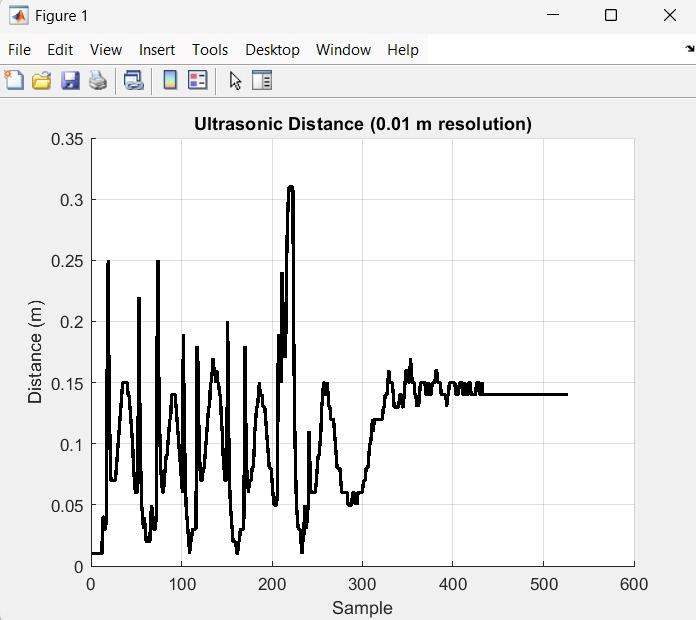
</p>

---

# System Identification

Experimental data were collected from the physical prototype and processed using MATLAB System Identification Toolbox.

Identified Models:

Model 1

P(s) = (1.625s + 2.959) / (s² + 15.09s + 12850)

Model 2

P(s) = (25.05s + 39.11) / (s² + 87.88s + 1.494 × 10⁻¹⁰)

---

## System Identification Toolbox

<p align="center">
  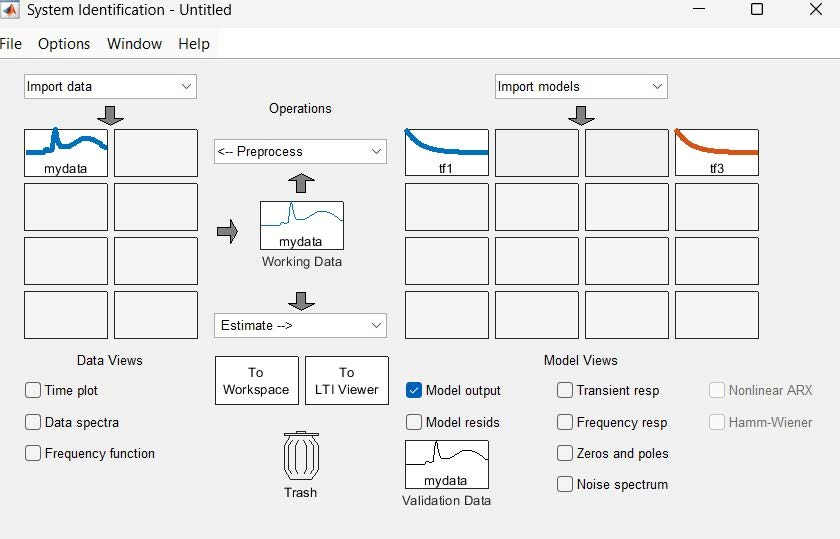
</p>

---

# Theoretical vs Practical Validation

One of the most important contributions of this project is the comparison between theoretical and experimentally identified models.

<p align="center">
  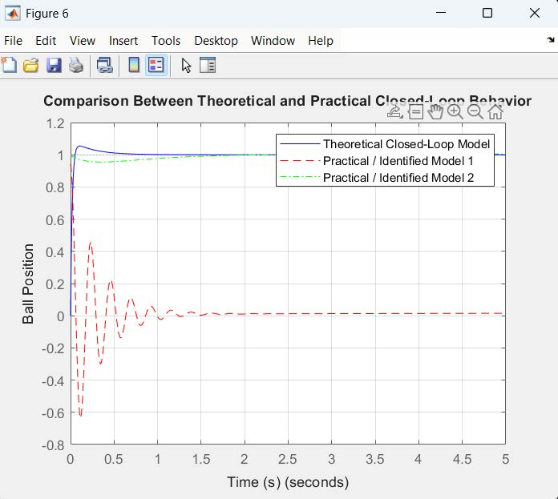
</p>

---

## Performance Comparison

| Model             | Overshoot (%) | Settling Time (s) | Steady-State Error |
| ----------------- | ------------- | ----------------- | ------------------ |
| Theoretical Model | 5.43          | 0.364             | 0                  |
| Practical Model 1 | 0.00          | 1005.137          | 0                  |
| Practical Model 2 | 0.77          | 0.000             | 0                  |

---

# Finite Element Analysis (FEA)

## Connecting Link Displacement

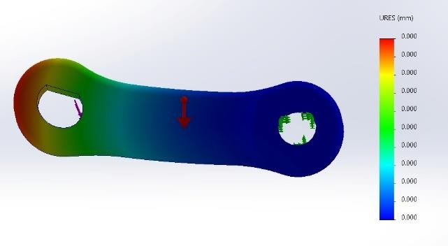

## Connecting Link Stress Distribution

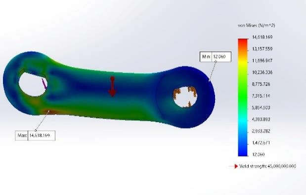

## Mesh and Boundary Conditions


## Beam Stress Distribution

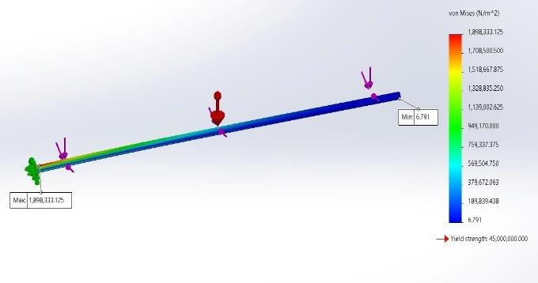

## Beam Displacement Distribution

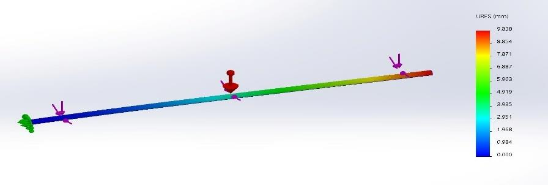

---

# Team Members

* Mahmoud Mohamed Shamekh
* Omar Mahmoud Metwally
* Youssef Mostafa Ayad
* Ebrahim Magdy Ebrahim

---

# Supervision

Dr. Amro Shafik

Eng. Mohamed Ashraf

---

# License

This repository is published for educational, academic, and research purposes.
